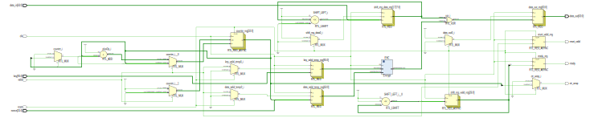
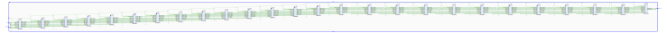
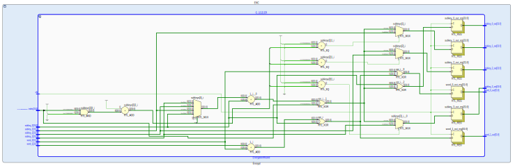

# Speck Cipher Hardware
This repository contains a VHDL and Python implementation of the Speck cipher as specified in NSA documents [0,1]. The VHDL code of Speck is pipelined and allows to define the desired key and block sizes through generics. CTR is available as cipher mode for Speck in hardware. Additionally an AXI4-Lite interface is included which allows easy hardware/software co-design with FPGAs. Tests are provided for both VHDL and Python. 

**Do not use this code to process sensitive information.** While we have done our best to ensure correctness, the code has not been audited and may be susceptible to cryptographic attacks.

## Requirements
The VHDL implementation of the cipher requires a VHDL-93 compatible synthesis tool. The VHDL testbenches use VHDL-2008 and therefore require a simulation tool that supports this standard, e.g. `Vivado 2016.4` and later. The Python implementation requires `Python 3.6` or later.

## Register Transfer Logic
The following images show the RTL schematics of Speck 64 96.

*CTR Mode*

*Encryption Pipeline*

*Encryption Round*

## References
[0] R. Beaulieu, D. Shors, J. Smith, S. Treatman-Clark, B. Weeks and L. Wingers, "The SIMON and SPECK Families of Lightweight Block Ciphers", Cryptology ePrint Archive, Report 2013/404, Available: [https://eprint.iacr.org/2013/404.pdf](https://eprint.iacr.org/2013/404.pdf)

[1] R. Beaulieu, D. Shors, J. Smith, S. Treatman-Clark, B. Weeks and L. Wingers, "SIMON and SPECK Implementation Guide", NSA Cybersecurity, June 26, 2018. [Online]. Available: [https://nsacyber.github.io/simon-speck/implementations/ImplementationGuide1.1.pdf](https://nsacyber.github.io/simon-speck/implementations/ImplementationGuide1.1.pdf) 
